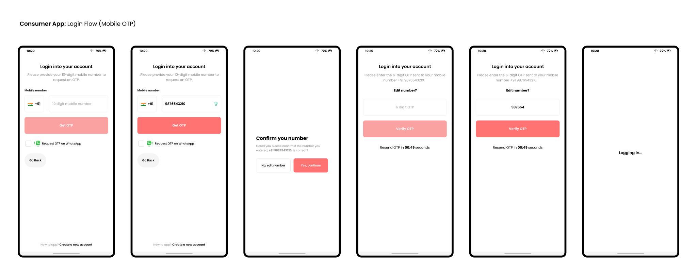
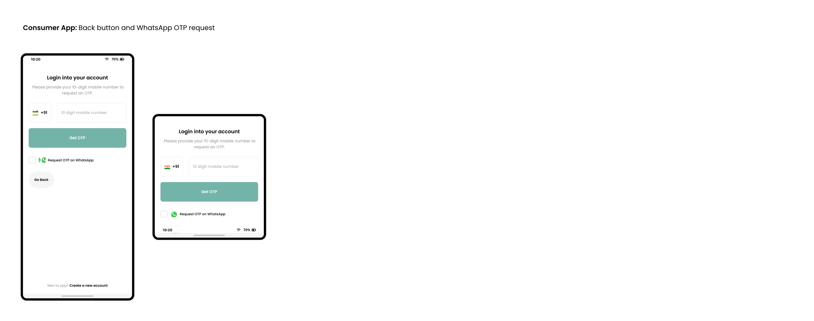

#### Background Story
I'll start with the background story of this project. Every project has its own story behind its existence, and this 
project also has its background story. I'm not a storyteller, but I'll try to explain it to you.

So it all started when I took a bunk in a lecture in college for once. I met another friend of mine whose name is 
`Hardik Sancheti`. While talking to him, I got to know that he needs a website for his tours and travels business. 
He was worried about the cost of making a website, and then suddenly I asked him if I could develop a mobile app for 
your business, and he agreed. After he agreed, I decided to work on this project.

### Designing phase
Well whenever I have to start working on any project, the first thing I do is start with design. 
Once you have the idea in your mind start designing the UI for it, and also I consider designing UX as well.
Although I'm not a professional UI/UX Designer but still I start with designing. And also this is not a paid project, 
so I cannot outsource designing and I kind of like designing UI as well.

#### Consumer App Login flow design (Mobile OTP)

If you take a closer look at the prototype that I have designed, you may notice that there is a `checkmark` which asks 
the user if he/she wants to receive OTP on `WhatsApp`. I want to promote `WhatsApp-based OTP` requests because it's a 
secure way to authenticate.

Also, I have made a minor change in UI design that improves user experience, which is adding a back button down below.

