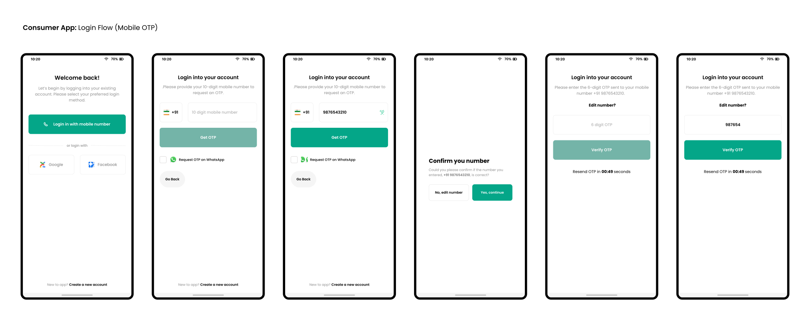

### Desiging phase
Well whenever I have to start working on any project, the first thing I do is start with design. 
Once you have the idea in your mind start desiging the UI for it and also I consider designing UX as well.
All though I'm not a professional UI/UX Desiginer but still I start with desiging. And also this is not a paid project so I cannot outsource designing and I kind of like desigining UI as well.

#### Consumer App Login flow design (Mobile OTP)

If you take a closer look at the prototype that I have designed, you may notice that there is a `checkmark` which asks the user if he/she wants to receive OTP on `WhatsApp`. I want to promote `WhatsApp-based OTP` requests because it's a secure way to authenticate.

Also, I have made a minor change in UI design that improves user experience, which is adding a back button down below.

